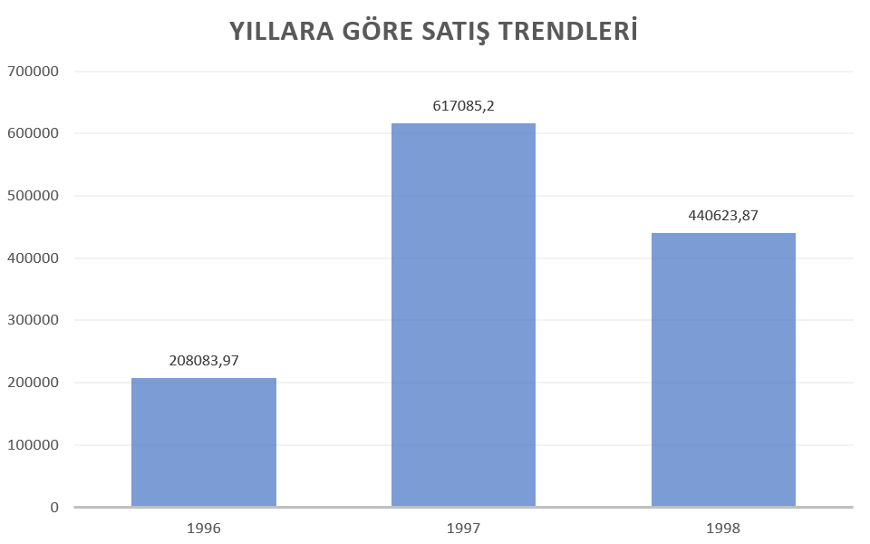
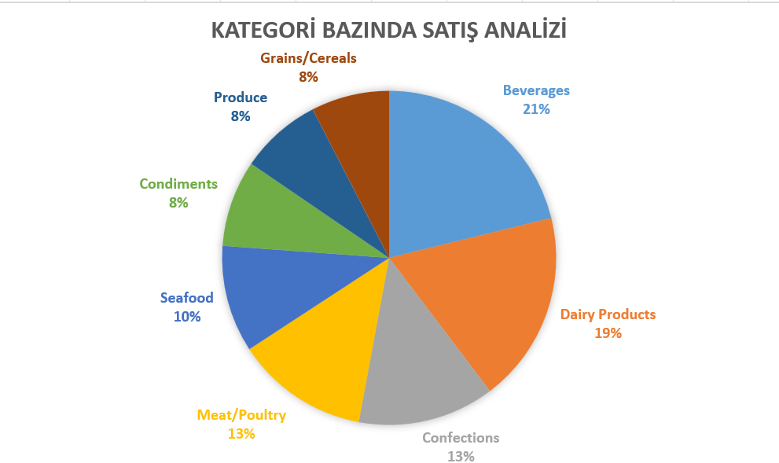
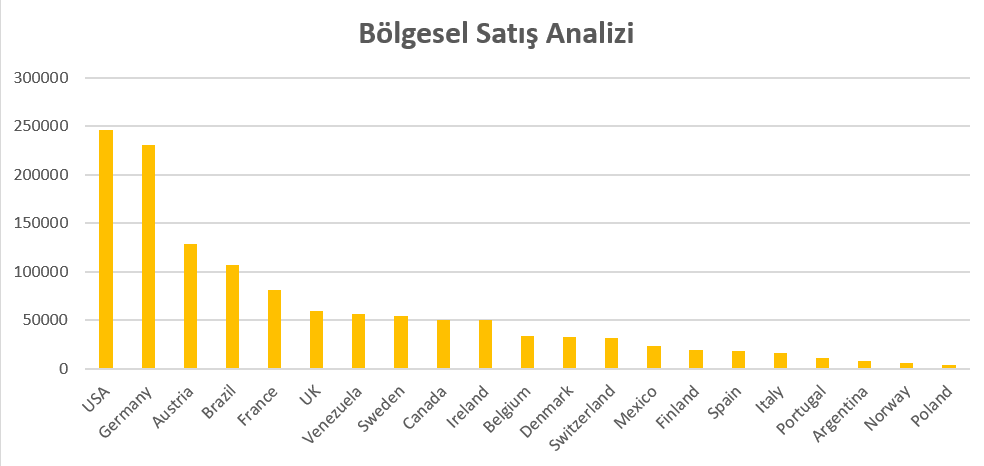
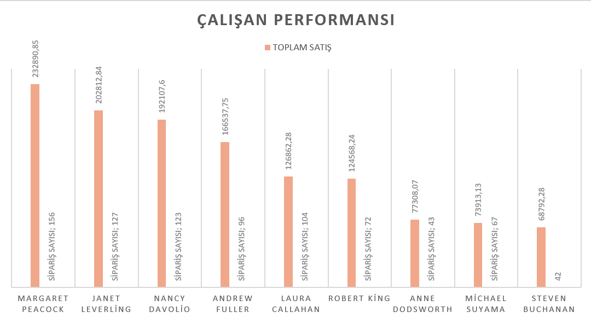
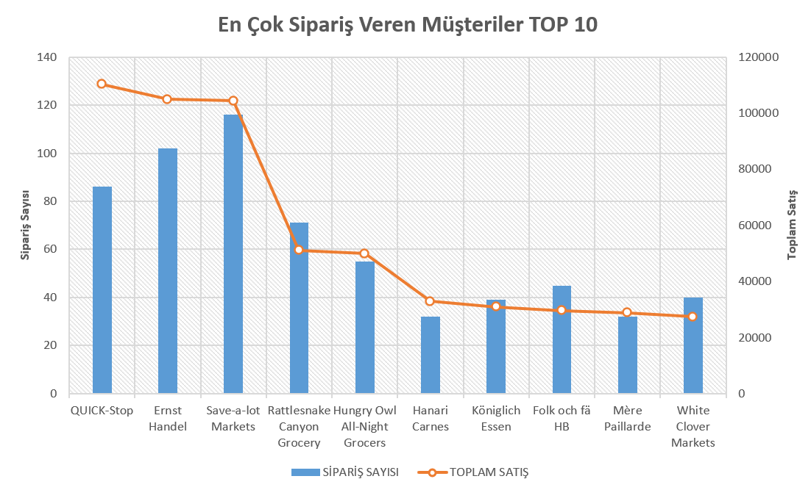

# Northwind-SQL-Analiz-Projesi
Bu proje, **Northwind veritabanı** üzerinde veri keşfi (EDA) ve analitik raporlama çalışmaları içermektedir.  
Amaç, SQL sorguları kullanarak iş senaryolarını analiz etmek ve görselleştirmeler ile desteklenen içgörüler üretmektir.  

---
## 📂 Proje İçeriği

- **`Northwind Veri Keşfi (EDA).sql`** → Veri keşfi ve kalite kontrolleri
  - Müşteri, sipariş, ürün sayıları
  - Eksik veri kontrolü
  - Yıllara göre sipariş dağılımı
  - Satış yapılan ülke sayısı
  - En çok satılan ürünler

- **`Northwind Analitik Raporlama.sql`** → İş analitiği raporlamaları
  - Yıllara göre satış trendleri
  - Kategori bazında satış analizi
  - Bölgesel satış analizi
  - Çalışan performansı
  - En çok sipariş veren müşteriler

---
## 🛠 Kullanılan Teknolojiler

  <!-- T-SQL -->
  
  
  <!-- Microsoft SQL Server -->
  
  
  <!-- Excel -->
  
  
  <!-- GitHub -->
  

---
## 📊 Görselleştirmeler

Aşağıda Excel dosyasındaki grafiklerin ekran görüntülerine yer verilmiştir:

### 1. Yıllara Göre Satış Trendleri
 

1997’de zirveye çıkan satışlar 1998’de kısmen düşse de, 1996’ya kıyasla uzun vadede artış göstermiştir.

### 2. Kategori Bazında Satış Analizi

Satışların %40’ı Beverages ve Dairy Products kategorilerinden geliyor, bu iki kategori kritik öneme sahip. Diğer kategoriler daha küçük paylara dağılmış, büyüme potansiyeli içeriyor.

### 3. Bölgesel Satış Analizi

Satışların çok büyük kısmı ABD ve Avrupa merkezli. Diğer bölgelerde (özellikle Latin Amerika ve Kuzey Avrupa) büyüme fırsatları var.

### 4. Çalışan Performansı

Çalışan performansında hem sipariş sayısı hem de sipariş başına düşen ortalama satış önemli. Margaret hem yüksek sipariş hem yüksek ciroda lider.

### 5. En Çok Sipariş Veren Müşteriler

Tüm siparişler aynı değerde değil. Özellikle QUICK-Stop, sipariş adedi Save-a-lot Markets’den daha az olmasına rağmen toplam satışta lider. Bu da sipariş başına satış değerinin yüksek olduğunu gösteriyor.

## 🚀 Kullanım

1. Northwind veritabanını SQL Server’a yükleyin.  
2. İlgili `.sql` dosyalarını çalıştırın.  
3. Çıktıları Excel’e aktararak görselleştirmeleri inceleyin.  

---

## 🎯 Amaç

Bu proje ile:  
- SQL ile veri keşfi ve analitik raporlama göstermek  
- İş kararlarını destekleyen görselleştirmeler üretmek  
- Veri odaklı bakış açısını geliştirmek hedeflenmiştir. 
